$${\color{#FAED27}hey, I'm}$$

$${\color{#FFF700}███████╗██╗━━██╗━█████╗━██╗━━━━██╗██╗██╗━━━━━██╗━━━━━██╗━━━██╗}$$

$${\color{#FFEF00}██╔════╝██║━━██║██╔══██╗██║━━━━██║██║██║━━━━━██║━━━━━╚██╗━██╔╝}$$

$${\color{#FFD700}███████╗███████║███████║██║━█╗━██║██║██║━━━━━██║━━━━━━╚████╔╝━}$$

$${\color{#FFD700}╚════██║██╔══██║██╔══██║██║███╗██║██║██║━━━━━██║━━━━━━━╚██╔╝━━}$$

$${\color{#FFB90F}███████║██║━━██║██║━━██║╚███╔███╔╝██║███████╗███████╗━━━██║━━━}$$

$${\color{#FFBF00}╚══════╝╚═╝━━╚═╝╚═╝━━╚═╝━╚══╝╚══╝━╚═╝╚══════╝╚══════╝━━━╚═╝━━━}$$

$${\color{#FFA500}━━━━━━━━━━━━━━━━━━━━━━━━━building━stuff━━━━━━━━━━━━━━━━━━━━━}$$

$${\color{#FF6600}━━━━━━━━━━━━━━━━━━━━to━get━better━at━building━stuff━━━━━━━━━━━}$$

 

$${\color{#FF6600}CREATOR \space OF}$$

	 
	
	 

	 
		
	 

