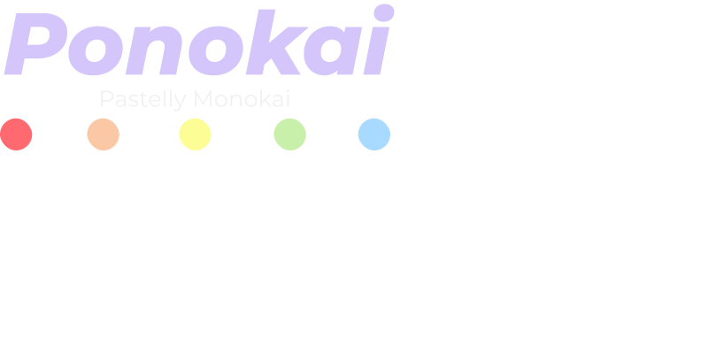

  

  <h2>Shane Williams · Senior Full-Stack Engineer</h2>
  
Building scalable systems at the intersection of IoT, cloud, and developer tooling

  
  
  

---

## About

5+ years building enterprise production systems. Currently architecting IoT energy management platforms at ResourceKraft — real-time data from thousands of devices. Previously scaled tooling at BioRender for 4M+ scientists worldwide.

---

## Tech Stack

**Languages**

**Frontend**

**Backend**

**Cloud & Infra**

**Tools**

---

## GitHub Stats

<table align="center">
  <tr>
    <td>
      
    </td>
    <td>
      
    </td>
  </tr>
</table>

---

## Featured Projects

**[ponokai](https://github.com/shawilly/ponokai)** — Pastelly Monokai color scheme for Vim/Neovim
`Vim Script` `Lua`

**[shell-quest](https://github.com/shawilly/shell-quest)** — Pirate-themed CLI learning game for kids
`Go`

**[react-simple-devicons](https://github.com/shawilly/react-simple-devicons)** — React SVG dev icon library
`TypeScript`
